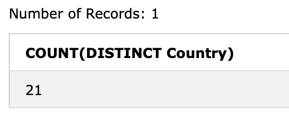

# 1 day

field \(column\), record \(row\)


The SELECT statement is used to select data from a database.

The data returned is stored in a result table, called the result-set.

```text
SELECT column1, column2, ...
FROM table_name;
```

Here, column1, column2, ... are the field names of the table you want to select data from. If you want to select all the fields available in the table, use the following syntax:

```text
SELECT * FROM table_name;
```

例子：

```text
SELECT CustomerName,City FROM Customers;
```


The SELECT DISTINCT statement is used to return only distinct \(different\) values.

Inside a table, a column often contains many duplicate values; and sometimes you only want to list the different \(distinct\) values.

```text
SELECT Country FROM Customers;
```


```text
SELECT DISTINCT Country FROM Customers;
```


```text
SELECT COUNT(DISTINCT Country) FROM Customers;
```



```text
SELECT COUNT(DISTINCT Country) AS DistinctCountries FROM Customers;
```

改名字：AS


